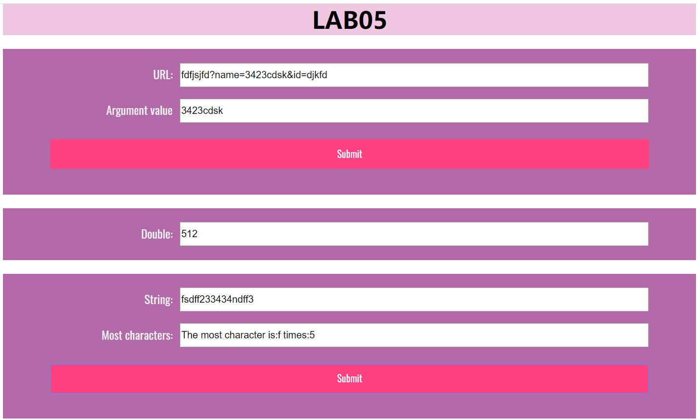
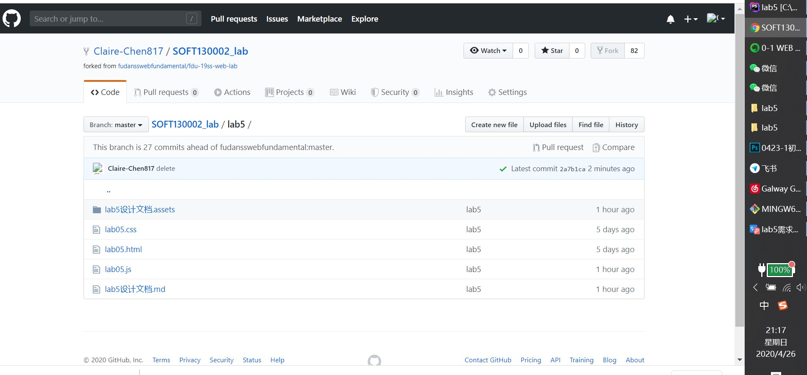

# Lab5设计文档

## 1.url
### 使用函数
`str.**slice**(index1,index2)` 将字符串从index1到index2的子串裁剪下来

`str.**indexOf**(substr)` 返回子串substr的第一个字符在str中的位置（若没有则返回-1）

### 解决方案
`url_result.value = url.value.slice(url.value.indexOf("name=")+5,url.value.indexOf("&"));`

将输入的url按上式裁剪得到name的具体值

## 2.mul
### 使用函数
`setInterval(function, milliseconds);` 函数function每经过milliseconds毫秒执行一次

`clearInterval()` 方法停止 `setInterval()` 方法中指定的函数的执行。

`Date.getSeconds()` 得到当下时间的秒数

### 解决方案
在函数 `timeTest()` 中声明一个Date，在函数外声明一个变量times来记录翻倍的次数。
如果得到的秒数为0或者times超过10则使用`clearInterval()`来使`timeTest`停止运行；否则将现有值翻倍，并增加times。

## 3.most
### 使用函数
`str.charAt(index)` 返回str中处在index位置上的character

### 解决方案
创建一个空数组carr，遍历字符串每一项，然后判断数组中是否含有遍历到的字符。
如果数组中没有有这个字符，把当前字符加入数组，令其值为1；
若数组中有这个字符，给这个字符所在位置的值加1。

然后运用for...in来遍历对象，其中未被声明的不会被遍历到，故可以求得出现最多的字符和它的出现次数。

##截图

